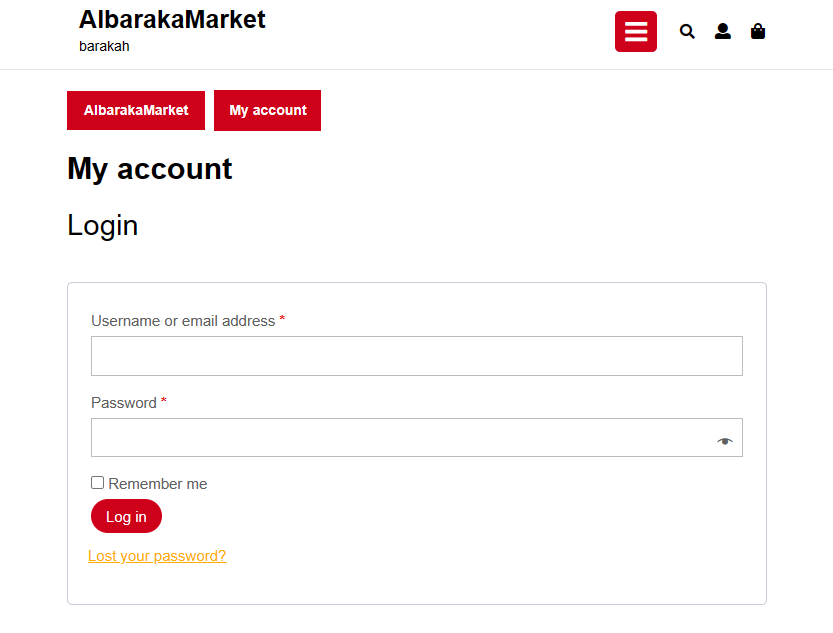
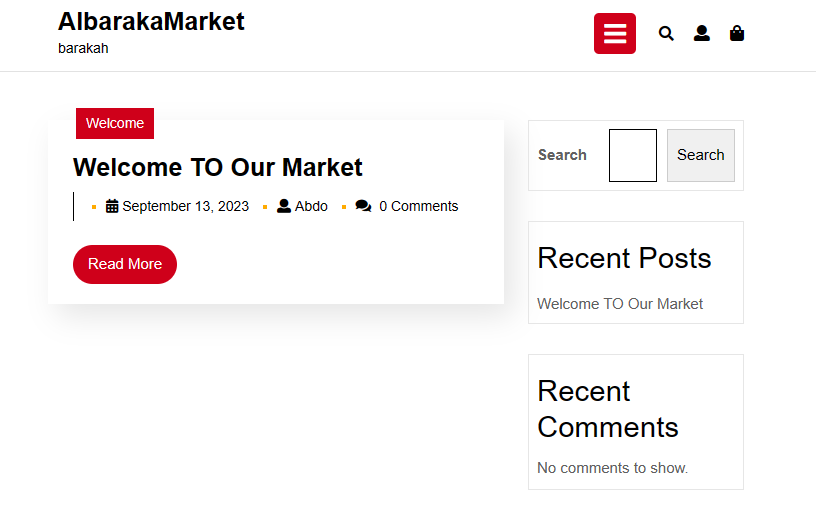
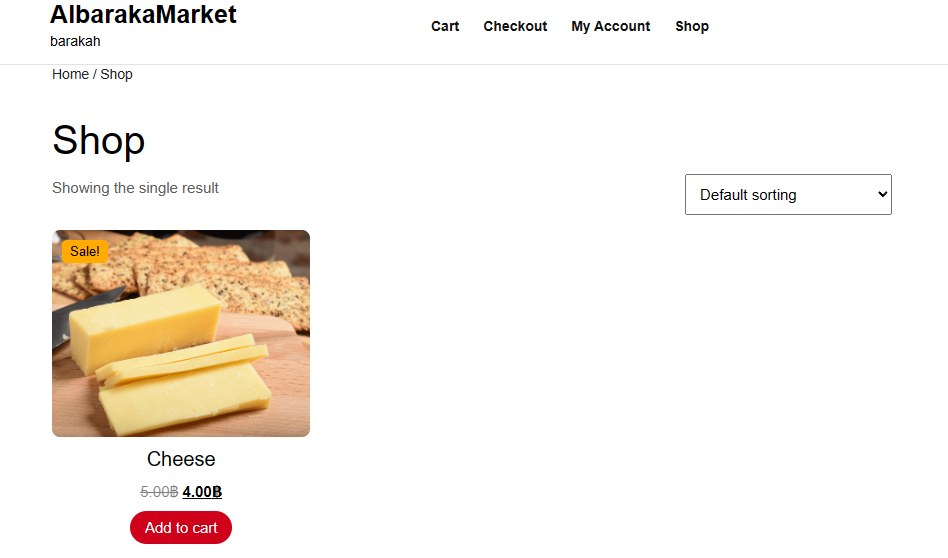
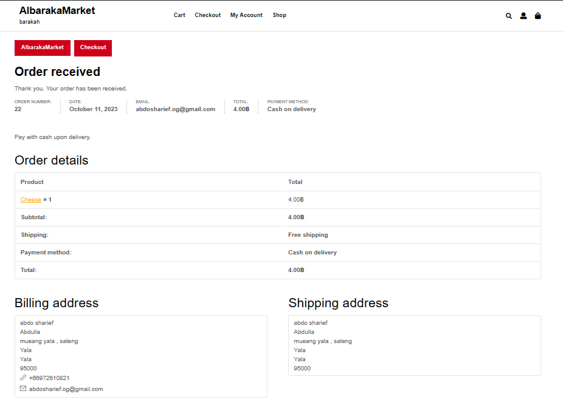
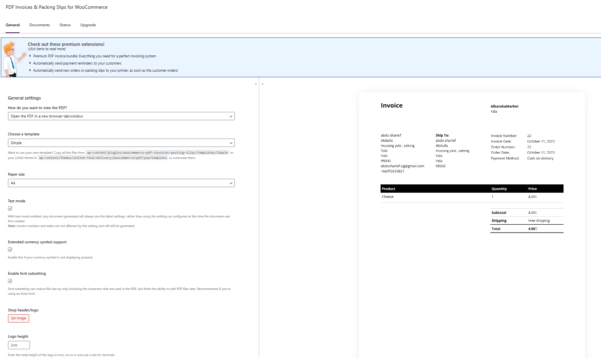

# Modern-Ecommerce-Platforms
Design and Develop Modern Ecommerce Plafform

## Project Overview
The project is about developing an E-Commerce Website for AlbarakaMarket , Food market. The website is built using the **WordPress** content management system (CMS) and will integrate the WooCommerce plugin to facilitate seamless e-commerce functionality. This platform will allow AlbarakaMarket customers to browse, select, and purchase books online, enhancing their shopping experience and providing a convenient way to access the store's offerings.

## Plugin
- WooCommerce
- Akismet Anti-spam: Spam Protection
- PDF Invoices & Packing Slips for WooCommerce
- Hello Dolly
  
## Theme
Online Food DeliveryVersion: 0.2.8   
By ThemesCaliber

## LOGIN

## Home PAGE

## USER INFO

## SHOP LIST

## CHOOSE PRODCUT

## CART

## CHECK OUT

## PILLING OPTIONS

## ORDER PILL

## ORDER TRACK

## INVOICES

### Customer pool

- **Customer Pool:** Represents the group of customers interacting with the platform.

- **Start Event (Green Circle):** Marks the beginning of the customer's journey on the platform.

- **Make an Order Process:** Encompasses the steps related to creating an order.

  - **Select Products:** The customer selects the desired products from the available options.

      

  
  - **Add to Cart:** The selected products are added to the customer's shopping cart.

      

- **Check Out Process:** The process to Checkout the product. 

  - **Fill the shipping detail:** The customer fill their shipping detail.

      
  
  - **Identify payment method:** Payment information, such as credit card details, is entered.

      
  
  - **Make a payment:** In my website have 2 paymant method are banking tranfer and 2C2P.  

      
     

- **Send payment proof:** If the customer choose banking tranfer, they have to sent the photo of payment. but If the customer use 2C2P, they no need to sent the proof.
- **Order Completed:** The final step indicating that the order has been successfully placed.

### Website pool
- pppp
- ppp
 
### Banking system pool
 dasdsadsadsa, sadsadsa.

### 2C2P pool
dasdsad dsadasdsad
dasda

### Shipping company
its sdasdsda, dsadasdas. 

## Author
Bukhoree Sohprajin - 631431003
