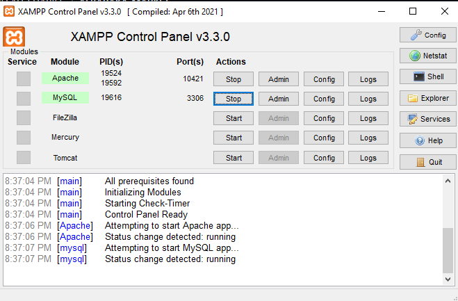
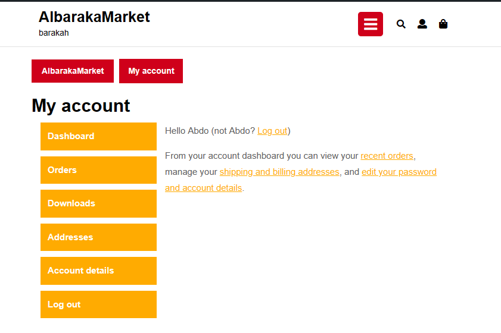
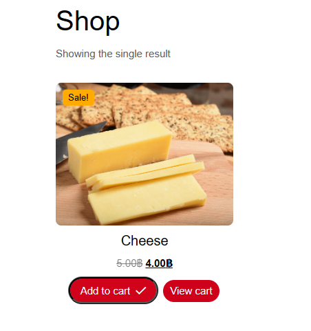
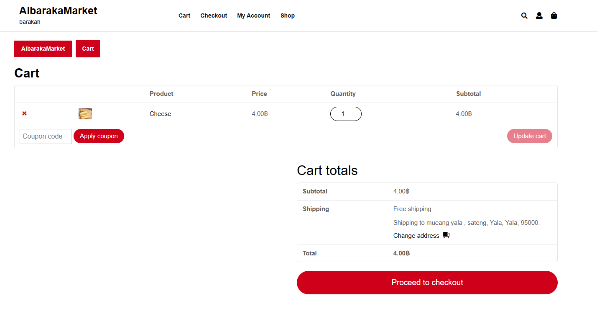
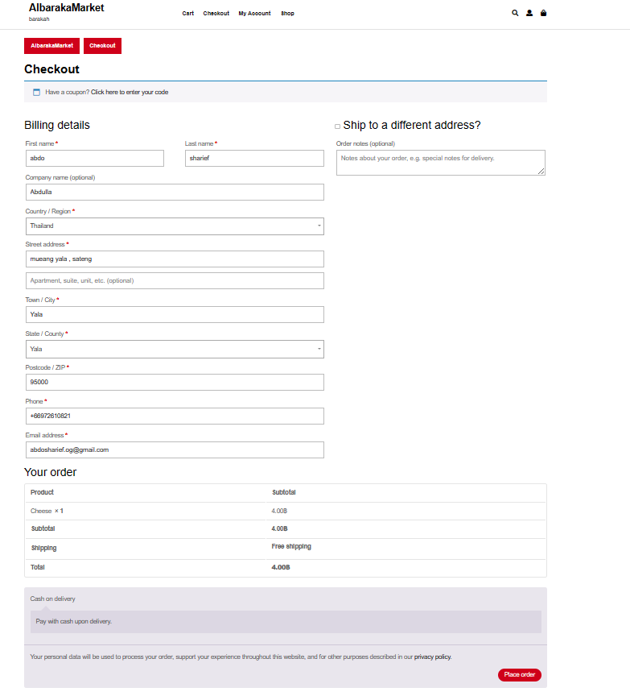
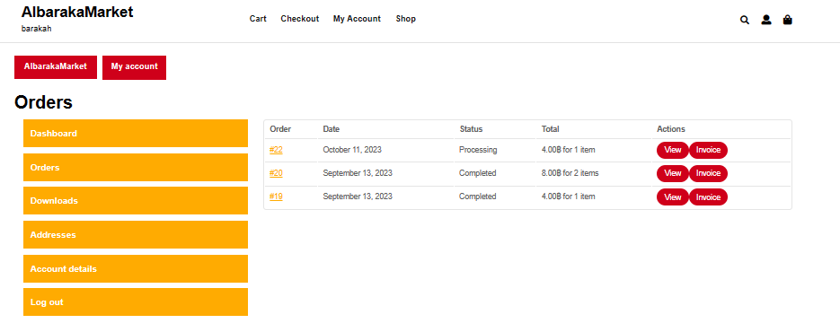

# Modern-Ecommerce-Platforms
Design and Develop Modern Ecommerce Plafform

## Project Overview
The project is about developing an E-Commerce Website for AlbarakaMarket , Food market. The website is built using the **WordPress** content management system (CMS) and will integrate the WooCommerce plugin to facilitate seamless e-commerce functionality. This platform will allow AlbarakaMarket customers to browse, select, and purchase Food prodcuts online, enhancing their shopping experience and providing a convenient way to access the store's offerings.

## DATABASE Platform
- Xamp v3.3.0
- PHP MY Admin

## Plugins
- WooCommerce
- Akismet Anti-spam: Spam Protection
- PDF Invoices & Packing Slips for WooCommerce
- Hello Dolly
  
## Theme
Online Food DeliveryVersion: 0.2.8   
By ThemesCaliber

## LOGIN

## Home PAGE

## USER INFO

## SHOP LIST

## CHOOSE PRODCUT

## CART

## CHECK OUT

## PILLING OPTIONS

## ORDER PILL

## ORDER TRACK

## INVOICES

## Author
ABDULLAH-ALSHARIEF 601431019
